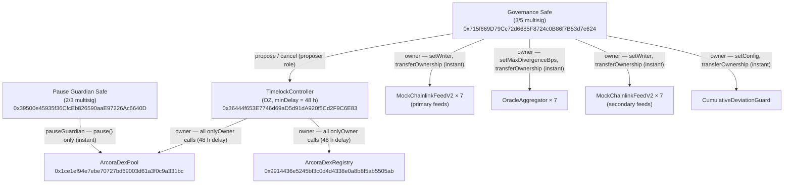

# ArcoraDEX — Architecture

**Date:** 2026-05-18
**Branch at authoring:** `phase4/audit-rollout`
**Audience:** Spearbit auditors
**Companion docs:** `docs/audit/audit-scope.md`, `docs/audit/threat-model.md`

---

## 1. Contract Topology

### Overview

ArcoraDEX is a multi-stablecoin shared vault. Three core contracts work together: a Registry that catalogues allowed tokens, a Pool that holds all reserves and executes all user operations, and an LP token that represents proportional ownership of the pool's net asset value. The oracle layer sits between the Registry and the underlying price feeds.

```
                    ┌─────────────────────────────────────────────┐
                    │            ArcoraDexPool                    │
                    │  (Ownable2Step, ReentrancyGuard)            │
                    │                                             │
                    │  reserves[token]          lastValidPrice[]  │
                    │  protocolFeesAccrued[]    lastAcceptedPrice[]│
                    │  lastMintAt[]             pauseGuardian      │
                    │  swapFeeBps               protocolFeeShareBps│
                    │                                             │
                    │  deposit() / withdraw() / swap()            │
                    │  quote() / quoteDeposit() / quoteWithdraw() │
                    └────────────┬────────────────┬──────────────┘
                                 │ immutable       │ immutable
                        deploys  │                 │ reads
                                 ▼                 ▼
              ┌─────────────────────┐   ┌─────────────────────────────┐
              │    ArcoraDexLP      │   │      ArcoraDexRegistry       │
              │  (ERC20)            │   │  (Ownable2Step)              │
              │                     │   │                               │
              │  MINTER = Pool      │   │  _info[token] → TokenInfo:   │
              │  mint() / burn()    │   │    decimals                  │
              │  _update() hook →   │   │    isActive                  │
              │  notifyLPTransfer() │   │    usdOracle  ◄──────────────┼──┐
              └─────────────────────┘   │    maxOracleDev Bps          │  │
                                        │    maxStaleSeconds           │  │
                                        │                               │  │
                                        │  listToken() / setOracle()   │  │
                                        │  setDeviation()               │  │
                                        └───────────────────────────────┘  │
                                                                            │
                              ┌─────────────────────────────────────────────┘
                              │  IChainlinkAggregator (per token)
                              ▼
              ┌───────────────────────────────────────────┐
              │         OracleAggregator (×7)             │
              │  (Ownable2Step, IChainlinkAggregator)     │
              │                                           │
              │  PRIMARY   (immutable)                    │
              │  SECONDARY (immutable)                    │
              │  maxDivergenceBps                         │
              │                                           │
              │  latestRoundData()  →  midpoint or        │
              │                        single-source      │
              │  sourceHealth()                           │
              └────────────┬──────────────────┬──────────┘
                           │                  │
               ┌───────────▼────┐  ┌──────────▼────────┐
               │ Primary Feed   │  │  Secondary Feed    │
               │MockChainlinkV2 │  │  MockChainlinkV2   │
               │ (testnet)      │  │  (testnet)         │
               └────────────────┘  └───────────────────-┘

              ┌───────────────────────────────────────────┐
              │       CumulativeDeviationGuard            │
              │  (Ownable2Step)                           │
              │                                           │
              │  windows[token]   configs[token]          │
              │  record()  →  PriceObserved event         │
              │             →  CircuitBreakerTripped event│
              │                (event-only; no auto-pause)│
              └───────────────────────────────────────────┘
```

### Contract relationships

**ArcoraDexPool** (`contracts/src/ArcoraDexPool.sol`, 678 LoC)

The Pool is the single entry point for all user operations (deposit, withdraw, swap). It holds all token reserves in an explicit `reserves[token]` mapping — balances are never read from `balanceOf`, which structurally blocks donation-inflation attacks. The Pool deploys `ArcoraDexLP` in its own constructor and stores the LP address in the immutable `LP`. The Pool reads token configuration from the `REGISTRY` immutable. Oracle prices flow through the registry: for each token operation the Pool calls `REGISTRY.tokenInfo(token)` to obtain the `usdOracle` address, then calls `usdOracle.latestRoundData()` directly.

**ArcoraDexLP** (`contracts/src/ArcoraDexLP.sol`, 42 LoC)

A minimal ERC20 whose `mint()` and `burn()` functions are restricted to `MINTER`, the immutable address set to the Pool at construction. The LP token has no owner and no admin. The `_update()` override propagates the Pool's min-hold lock through LP transfers: every non-mint/non-burn transfer calls `IArcoraDexPool(MINTER).notifyLPTransfer(from, to)`, which extends the recipient's lock to `max(to.lastMintAt, from.lastMintAt)`.

**ArcoraDexRegistry** (`contracts/src/ArcoraDexRegistry.sol`, 99 LoC)

Per-token catalogue owned by the `TimelockController`. Stores a `TokenInfo` struct per token address containing `decimals`, `isActive`, `usdOracle` (the `IChainlinkAggregator`-compatible oracle for that token), `maxOracleDeviationBps` (the per-swap price-change cap), and `maxStaleSeconds` (the staleness threshold for the oracle). All mutators (`listToken`, `setOracle`, `setDeviation`, `setMaxStaleSeconds`, `deactivateToken`, `reactivateToken`) are `onlyOwner`.

**OracleAggregator** (`contracts/src/oracle/OracleAggregator.sol`, 112 LoC)

A per-token `IChainlinkAggregator` wrapper. Wraps an immutable `PRIMARY` and an immutable `SECONDARY` feed. `latestRoundData()` reads both feeds via `_tryRead()` (which catches reverts), computes the midpoint when both succeed and agree within `maxDivergenceBps`, falls back to the surviving source when exactly one succeeds, and reverts `AllSourcesUnavailable` when both fail or `SourcesDiverge` when both succeed but diverge beyond `maxDivergenceBps`. Because it implements `IChainlinkAggregator`, the Pool and Registry interact with it identically to a direct Chainlink feed. Ownership is held by the Governance Safe.

**CumulativeDeviationGuard** (`contracts/src/oracle/CumulativeDeviationGuard.sol`, 93 LoC)

A permissionless, event-only rolling-deviation recorder. Off-chain keepers call `record(token, price1e18)` after each oracle update. The contract tracks a per-token tumbling 24 h window (configurable via `setConfig`, `onlyOwner`). When the cumulative deviation from the window's anchor price exceeds `maxCumulativeBps`, `CircuitBreakerTripped` is emitted. No on-chain pause is triggered in the current phase (P3); the event stream is consumed by an off-chain monitor that can submit a Pause Guardian Safe transaction. Ownership is held by the Governance Safe.

### Seven stablecoins

The pool lists seven stablecoins: USDC, USDT, PYUSD, DAI, EURC, TRYC, and BRLC. Each has one `OracleAggregator` registered in the Registry's `usdOracle` slot. All token decimals and staleness parameters are verified in the Registry at `listToken` time.

---

## 2. Governance Stack

### Overview (Mermaid)



### Role inventory

All modifiers in `ArcoraDexPool.sol` and `ArcoraDexRegistry.sol` were verified against the source:

- `onlyOwner` (inherited from `Ownable2Step`): checked in `ArcoraDexPool` at `setSwapFeeBps`, `setProtocolFeeShareBps`, `withdrawProtocolFees`, `unpause`, `setPauseGuardian`, `syncAcceptedPrice`, `transferOwnership`/`acceptOwnership`; checked in `ArcoraDexRegistry` at `listToken`, `setOracle`, `setDeviation`, `setMaxStaleSeconds`, `deactivateToken`, `reactivateToken`.
- `onlyOwnerOrGuardian` (defined at `ArcoraDexPool.sol` lines 83–86): `msg.sender == owner() || msg.sender == pauseGuardian`; used exclusively by `pause()`.

| Action | Who can call | Delay |
|--------|--------------|-------|
| `setSwapFeeBps` | Owner (Timelock) | 48 h |
| `setProtocolFeeShareBps` | Owner (Timelock) | 48 h |
| `withdrawProtocolFees` | Owner (Timelock) | 48 h |
| `setPauseGuardian` | Owner (Timelock) | 48 h |
| `syncAcceptedPrice` | Owner (Timelock) | 48 h |
| `listToken` | Owner (Timelock) | 48 h |
| `setOracle` | Owner (Timelock) | 48 h |
| `setDeviation` | Owner (Timelock) | 48 h |
| `setMaxStaleSeconds` | Owner (Timelock) | 48 h |
| `deactivateToken` / `reactivateToken` | Owner (Timelock) | 48 h |
| `pause()` | Owner (Timelock) **or** Pause Guardian Safe | Owner: 48 h; Guardian: instant |
| `unpause()` | Owner (Timelock) **only** | 48 h |
| `setWriter` (feeds) | Governance Safe direct | Instant (no Timelock) |
| `setMaxDivergenceBps` (aggregators) | Governance Safe direct (owns aggregators) | Instant (no Timelock) |
| `setConfig` (guard) | Governance Safe direct (owns guard) | Instant (no Timelock) |

**Key asymmetry — pause vs. unpause.** `pause()` is `onlyOwnerOrGuardian`; `unpause()` is `onlyOwner`. A compromised Pause Guardian Safe (2/3 of three keys) can halt the pool instantly but cannot restart it. Restarting requires a Governance Safe proposal scheduled through the 48 h Timelock. This is a deliberate design choice documented in `ArcoraDexPool.sol` lines 621–629.

**Feed / aggregator ownership — no Timelock.** The seven primary feeds (`MockChainlinkFeedV2`) and the seven `OracleAggregator` contracts and the seven secondary feeds and the `CumulativeDeviationGuard` are owned directly by the Governance Safe with no intermediate Timelock. This allows emergency feed-writer rotation in a single Safe multisig transaction (relevant runbook: `docs/rollouts/2026-05-14-phase2-governance.md` §"Feed writer rotation"). The accepted risk is that a compromised 3/5 Governance Safe could rotate feed writers instantly; compensating control is the 48 h Timelock on `Registry.setOracle`, which governs whether the Pool actually uses the (potentially rotated) feed.

---

## 3. Oracle Layer

### Per-token oracle chain

```
ArcoraDexPool._readOracle(token)
        │
        │  calls REGISTRY.tokenInfo(token)
        │  obtains  info.usdOracle  →  OracleAggregator address
        │
        └─► OracleAggregator.latestRoundData()
                    │
                    │  _tryRead(PRIMARY)   → (ok, answer, updatedAt)
                    │  _tryRead(SECONDARY) → (ok, answer, updatedAt)
                    │
                    ├─ Both ok, within maxDivergenceBps → return midpoint
                    ├─ Both ok, diverge beyond cap      → revert SourcesDiverge
                    ├─ Only PRIMARY ok                  → return primary
                    ├─ Only SECONDARY ok                → return secondary
                    └─ Neither ok                       → revert AllSourcesUnavailable
```

### Three distinct deviation knobs

These three parameters measure distinct quantities and are not redundant. All three were verified in the contract source and explained in `docs/rollouts/2026-05-14-phase3-oracle.md` §"Note on the three deviation caps".

| Parameter | Location | What it measures | Enforcement |
|-----------|----------|------------------|-------------|
| `OracleAggregator.maxDivergenceBps` | `OracleAggregator.sol` line 30 | Spread between the **primary and secondary source prices** at read time | Revert `SourcesDiverge` during `latestRoundData()` — happens inside the aggregator before any price reaches the Pool |
| `ArcoraDexRegistry.maxOracleDeviationBps` (per token) | `IArcoraDexRegistry.TokenInfo.maxOracleDeviationBps` | Jump from the **aggregator's output vs. the Pool's cached/last-accepted price** (`lastAcceptedPrice[token]`) per operation | Revert `PriceDeviation` in `_readAndGuardPrice()` (stateful path, used in deposit/withdraw/swap) and in `_readUsdPrice1e18WithGuard()` (view path, used in quote functions); the cache-deviation guard within `_readUsdPrice1e18Mut()` additionally demotes a fresh oracle reading that jumps too far from `lastValidPrice[token]`, preventing cache poisoning within a single block |
| `CumulativeDeviationGuard.maxCumulativeBps` (per token) | `CumulativeDeviationGuard.sol` `Config.maxCumulativeBps` | **Absolute (unsigned) deviation** from the tumbling-window anchor price over the window period — fires equally for an up-move or a down-move of the same magnitude | Event-only: emits `CircuitBreakerTripped`; no on-chain auto-pause in P3 |

**Deployed configuration (post-P3 batch execution):**

| Token | Aggregator `maxDivergenceBps` | Registry `maxOracleDeviationBps` | Guard `maxCumulativeBps` | Guard window |
|-------|-------------------------------|----------------------------------|--------------------------|--------------|
| USDC  | 50  | 200  | 200 | 86 400 s (24 h) |
| USDT  | 50  | 200  | 200 | 86 400 s (24 h) |
| PYUSD | 50  | 200  | 200 | 86 400 s (24 h) |
| DAI   | 50  | 200  | 200 | 86 400 s (24 h) |
| EURC  | 100 | 200  | 300 | 86 400 s (24 h) |
| TRYC  | 200 | 200  | 500 | 86 400 s (24 h) |
| BRLC  | 200 | 200  | 500 | 86 400 s (24 h) |

*TRYC and BRLC registry caps were 5 000 bps before the P3 Timelock batch; they are reduced to 200 bps by operations 8–9 in that batch (scheduled batch id `0x31218725...`, executable ≈ 2026-05-20).*

### `_readOracle` internals

`_readOracle(token)` (lines 98–135 of `ArcoraDexPool.sol`) is `internal view` — it reads state but never writes it:

1. Calls `REGISTRY.tokenInfo(token)` to get `info.usdOracle`, `info.decimals`, `info.isActive`, `info.maxStaleSeconds`.
2. Reverts `TokenNotActive` if `!info.isActive`.
3. Wraps `info.usdOracle.latestRoundData()` in a `try/catch`. On revert, sets `isFresh = false` and returns without a price.
4. When the outer call succeeds, validates: `roundId != 0`, `answeredInRound >= roundId`, `updatedAt != 0`, `updatedAt <= block.timestamp`, `(block.timestamp - updatedAt) <= maxStaleSeconds`, `answer > 0`. Any failure sets `isFresh = false`.
5. When all validations pass, wraps `info.usdOracle.decimals()` in a `try/catch` and normalises the answer to 1e18-scaled USD. A revert from `decimals()` also sets `isFresh = false`.
6. Returns `(price1e18, tokenDecimals, isFresh)` without writing any storage.

### Cache and ratchet mechanics

Two storage layers sit above `_readOracle`:

**`lastValidPrice[token]`** — the last 1e18-scaled price successfully returned from `_readOracle` and accepted by the cache-deviation guard. Written by `_readUsdPrice1e18Mut()` (lines 142–179), which is the stateful wrapper used in the deposit/withdraw/swap execution paths. A fresh oracle reading that deviates more than `maxOracleDeviationBps` from the current cache is demoted to stale and the cache is returned instead; this prevents a compromised oracle from poisoning the cache in a single block.

**`lastAcceptedPrice[token]`** — the price at which the most recent user operation executed (written by `_readAndGuardPrice()` at line 327). Each new operation checks the candidate price against `lastAcceptedPrice`; a deviation beyond `maxOracleDeviationBps` reverts `PriceDeviation`. This ratchet prevents a slow-walk drain: even if `lastValidPrice` is updated incrementally, each swap/deposit/withdraw can move the anchor at most `maxOracleDeviationBps` from the previous anchor. The ratchet can be reset by the owner via `syncAcceptedPrice(token)` (an operator escape hatch for legitimate large price moves).

**`lastValidPriceAt[token]`** — block timestamp of the last successful cache write. Stored alongside `lastValidPrice` for off-chain diagnostics; not used in any on-chain path.

---

## 4. Data Flows

### Deposit

A user calls `Pool.deposit(token, amount, minLpOut, deadline)`.

```
User
 │
 │  deposit(token, amount, minLpOut, deadline)
 ▼
ArcoraDexPool.deposit()
 │  1. modifier: whenNotPaused, nonReentrant, checkDeadline
 │  2. _readAndGuardPrice(token)
 │       │  a. _readUsdPrice1e18Mut(token)
 │       │       │  i.  _readOracle(token)
 │       │       │       └─► REGISTRY.tokenInfo(token)   [SLOAD]
 │       │       │       └─► OracleAggregator.latestRoundData()
 │       │       │              └─► PRIMARY.latestRoundData()
 │       │       │              └─► SECONDARY.latestRoundData()
 │       │       │       └─ validate: roundId, timestamps, staleness, answer > 0
 │       │       │       └─► OracleAggregator.decimals()
 │       │       │       └─ normalise to price1e18, return (price1e18, dec, isFresh)
 │       │       │  ii. cache-deviation guard:
 │       │       │       if isFresh AND lastValidPrice[token] != 0:
 │       │       │         if |price1e18 - cached| > cached * maxOracleDeviationBps/BPS:
 │       │       │           isFresh = false  (demote; cache returned instead)
 │       │       │  iii. if isFresh: write lastValidPrice[token], lastValidPriceAt[token]
 │       │       │       else:       return lastValidPrice[token]  (or revert NoValidPrice)
 │       │  b. ratchet guard (lastAcceptedPrice):
 │       │       if lastAcceptedPrice[token] != 0:
 │       │         if |price1e18 - prev| > prev * maxOracleDeviationBps/BPS:
 │       │           revert PriceDeviation
 │       │  c. write lastAcceptedPrice[token] = price1e18
 │       └─ returns (price1e18, tokenDecimals)
 │  3. compute usdIn = amount * price1e18 / 10^decimals
 │  4. compute lpMinted:
 │       if supply == 0: lpMinted = usdIn * VIRTUAL_SHARES / VIRTUAL_ASSETS
 │       else: navBefore = _totalReservesUSDMut()   [reads oracle for all active tokens]
 │             lpMinted  = usdIn * (supply + VIRTUAL_SHARES) / (navBefore + VIRTUAL_ASSETS)
 │  5. check lpMinted >= minLpOut
 │  6. IERC20(token).safeTransferFrom(user → Pool, amount)
 │  7. reserves[token] += amount
 │  8. if supply == 0: LP.mint(DEAD_ADDRESS, MINIMUM_LIQUIDITY)
 │  9. LP.mint(user, lpMinted)
 │       └─ ArcoraDexLP._update(0, user, lpMinted)  [mint; no notifyLPTransfer]
 │  10. lastMintAt[user] = block.timestamp
 │  11. emit Deposited(...)
 └─ returns lpMinted
```

### Swap

A user calls `Pool.swap(tokenIn, tokenOut, amountIn, minOut, deadline, recipient)`.

```
User
 │
 │  swap(tokenIn, tokenOut, amountIn, minOut, deadline, recipient)
 ▼
ArcoraDexPool.swap()
 │  1. modifier: whenNotPaused, nonReentrant, checkDeadline
 │  2. _readAndGuardPrice(tokenIn)   → (pIn, dIn)
 │       [same oracle read path as deposit step 2 above]
 │  3. _readAndGuardPrice(tokenOut)  → (pOut, dOut)
 │       [same oracle read path]
 │  4. compute gross = _grossOut(amountIn, pIn, pOut, dIn, dOut)
 │       = (amountIn * pIn / 10^dIn) * 10^dOut / pOut
 │         (USD-normalised cross-token pricing)
 │  5. fee = gross * swapFeeBps / BPS
 │     amountOut = gross - fee
 │     protFee   = fee * protocolFeeShareBps / BPS
 │  6. check amountOut >= minOut
 │  7. check reserves[tokenOut] >= amountOut + protFee
 │  8. CEI pattern:
 │       IERC20(tokenIn).safeTransferFrom(user → Pool, amountIn)
 │       reserves[tokenIn]  += amountIn
 │       reserves[tokenOut] -= (amountOut + protFee)
 │       protocolFeesAccrued[tokenOut] += protFee
 │       IERC20(tokenOut).safeTransfer(recipient, amountOut)
 │  9. emit Swapped(...)
 └─ returns amountOut
```

### Oracle read path (isolated)

This is the canonical oracle read path exercised by every stateful operation. Two view-only reader wrappers sit above `_readOracle` alongside the stateful ones: `_readUsdPrice1e18WithGuard` (used by `quote()`, `quoteDeposit()`, and `quoteWithdraw()` for per-token price reads) is a stricter view variant that runs the `lastAcceptedPrice` ratchet check against the raw oracle reading and can revert `PriceDeviation` — a scenario where the stateful `_readUsdPrice1e18Mut` path would silently fall back to the cache instead; `_readUsdPrice1e18View` is the cache-aware view reader used only inside `totalReservesUSD()` (NAV computation), which `quoteDeposit()` and `quoteWithdraw()` call for the NAV term, not for the per-token price.

```
_readOracle(token)               ← internal view; no state writes
    │
    ├─ REGISTRY.tokenInfo(token) ← view SLOAD; provides usdOracle, decimals, maxStaleSeconds, isActive
    │
    ├─ try: usdOracle.latestRoundData()
    │         │                         ← usdOracle is OracleAggregator
    │         ▼
    │   OracleAggregator.latestRoundData()
    │         │
    │         ├─ _tryRead(PRIMARY)      ← try: PRIMARY.latestRoundData(); catch → (false, 0, 0)
    │         ├─ _tryRead(SECONDARY)    ← try: SECONDARY.latestRoundData(); catch → (false, 0, 0)
    │         │
    │         ├─ both fail:   revert AllSourcesUnavailable  ─┐
    │         ├─ primary only: return (1, pAns, pAt, pAt, 1)  │
    │         ├─ secondary only: return (1, sAns, sAt, sAt, 1)│  all caught by
    │         └─ both ok:                                      │  Pool's try/catch
    │               |pAns - sAns| > minAns * maxDivergenceBps/10000
    │                 → revert SourcesDiverge                ─┘
    │               else: mid = (pAns + sAns)/2
    │                     latestAt = max(pAt, sAt)
    │                     return (1, mid, latestAt, latestAt, 1)
    │
    ├─ on revert from latestRoundData():  isFresh = false  (caught)
    │
    ├─ validate answer: roundId != 0, answeredInRound >= roundId,
    │                   updatedAt != 0, updatedAt <= block.timestamp,
    │                   (now - updatedAt) <= maxStaleSeconds, answer > 0
    │                   → any failure: isFresh = false
    │
    ├─ try: usdOracle.decimals() → normalise to 1e18
    │   on revert: isFresh = false
    │
    └─ return (price1e18, tokenDecimals, isFresh)

_readUsdPrice1e18Mut(token)     ← internal; writes lastValidPrice, lastValidPriceAt
    │
    ├─ calls _readOracle(token) → (price1e18, dec, isFresh)
    ├─ cache-deviation guard: if isFresh AND lastValidPrice != 0:
    │       |price1e18 - cached| > cached * maxOracleDeviationBps/BPS → isFresh = false
    ├─ if isFresh: write lastValidPrice[token] = price1e18
    │              write lastValidPriceAt[token] = block.timestamp
    └─ if !isFresh: return lastValidPrice[token] (or revert NoValidPrice if unset)

_readAndGuardPrice(token)        ← internal; additionally writes lastAcceptedPrice
    │
    ├─ calls _readUsdPrice1e18Mut(token) → (price1e18, dec)
    ├─ ratchet guard: if lastAcceptedPrice[token] != 0:
    │       |price1e18 - prev| > prev * maxOracleDeviationBps/BPS → revert PriceDeviation
    └─ write lastAcceptedPrice[token] = price1e18

_readUsdPrice1e18WithGuard(token) ← internal view; does NOT write state
    │                                used by: quote(), quoteDeposit(), quoteWithdraw()
    │                                (per-token price reads in quote functions)
    ├─ calls _readOracle(token) → (rawPrice1e18, dec, isFresh)
    ├─ fresh-branch ratchet (STRICTER than stateful path):
    │       if isFresh AND lastAcceptedPrice[token] != 0:
    │         |rawPrice1e18 - prev| > prev * maxOracleDeviationBps/BPS
    │           → revert PriceDeviation
    │           (fires even when the mut path would silently fall back to cache)
    ├─ inline cache-deviation guard (same semantics as _readUsdPrice1e18View):
    │       if isFresh AND lastValidPrice != 0 AND deviation > cap: isFresh = false
    ├─ price1e18 = isFresh ? rawPrice1e18 : lastValidPrice[token]
    ├─ if price1e18 == 0: revert NoValidPrice
    └─ stale-branch ratchet: if !isFresh AND lastAcceptedPrice[token] != 0:
            |price1e18 - prev| > prev * maxOracleDeviationBps/BPS → revert PriceDeviation

_readUsdPrice1e18View(token)     ← internal view; does NOT write state
    │                               used by: totalReservesUSD()
    │                               (NAV computation — called by quoteDeposit/quoteWithdraw
    │                                for the NAV term, NOT for the per-token price)
    ├─ calls _readOracle(token) → (price1e18, dec, isFresh)
    ├─ cache-deviation guard: if isFresh AND lastValidPrice != 0:
    │       |price1e18 - cached| > cached * maxOracleDeviationBps/BPS → isFresh = false
    ├─ if isFresh: return (price1e18, tokenDecimals)
    └─ else: return lastValidPrice[token] (or revert NoValidPrice if unset)
```

### LP transfer lock propagation

When a holder of ADEX-LP transfers tokens to another address:

```
IERC20(LP).transfer(recipient, amount)
    │
    ▼
ArcoraDexLP._update(from, to, amount)
    │  (skipped for mints: from == 0; skipped for burns: to == 0)
    │
    └─► IArcoraDexPool(MINTER).notifyLPTransfer(from, to)
            │
            └─ if lastMintAt[from] > lastMintAt[to]:
                   lastMintAt[to] = lastMintAt[from]
               (recipient inherits the sender's unexpired hold)
```

This closes the JIT bypass where an attacker deposits to a fresh wallet, transfers LP to a second wallet that has never minted, and immediately withdraws from the second wallet before the hold expires.

---

*All claims in this document are verified against the contract source at `contracts/src/`. For governance addresses and oracle addresses see `docs/rollouts/2026-05-14-phase2-governance.md` and `docs/rollouts/2026-05-14-phase3-oracle.md`. For the finding-to-fix mapping see `docs/audit/threat-model.md`.*
